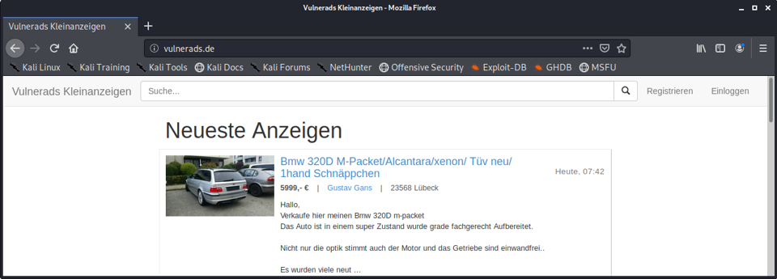
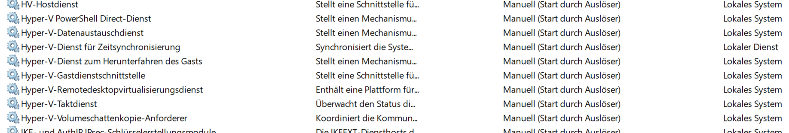

# Willkommen bei Vulnerads

> This page is also available in [English](/?lang=en)

-----

Moin moin,

vermutlich bist du auf dieser Seite gelandet, weil du an der Schulung ["Sicherheit für Webanwendungen"](https://www.oose.de/seminar/web-app-security/) teilnehmen wirst. In dieser Schulung werden wir die Anwendung Vulnerads - eine sicherheitslückenreiche Version bekannter Kleinanzeigen-Webanwendungen - Stück für Stück auseinandernehmen und absichern.

Für die Schulung habe ich dir eine virtuelle Maschine für Oracle VirtualBox erstellt, die du herunterladen und bei dir importieren musst. Ein großer Teil der Schulung findet als praktische Beispiele und Übungen in der virtuellen Maschine statt, es ist also wichtig, dass diese bei dir gut läuft.

# Schritt für Schritt

1. Lade dir die aktuelle Version von [VirtualBox](https://www.virtualbox.org/wiki/Downloads) für dein Betriebssystem herunter und installiere es.
2. Lade dir die [virtuelle Maschine](https://vulnerads.de/vm/) herunter (**ca. 10,5 GB**).
3. Importiere die heruntergeladene VM in VirtualBox. Achte darauf, dass der virtuellen Machine möglichst viel, aber nicht zu viel Arbeitsspeicher zugewiesen ist. >10GB wären optimal, allerdings solltest du nicht viel mehr als die Hälfte deines Host-Arbeitsspeichers an die virtuelle Maschine vergeben.
4. Jetzt kannst du die Maschine starten. Sie sollte in Kali Linux booten und automatisch eingeloggt sein. Falls etwas nicht klappt: Der Benutzername ist `kali` und das Passwort `kali`. Beim Systemstart werden auch Firefox und IntelliJ IDEA automatisch gestartet.
5.  Bitte prüfe, dass aus der virtuellen Maschine Zugriff auf das Internet besteht, da einige Übungen dies voraussetzen. Öffnet hierzu beispielsweise [https://www.github.com](https://www.github.com) aus den Browsern Chromium und Firefox der virtuellen Maschine heraus. Gegebenenfalls passt bitte die Netzwerkadaptereinstellungen in VirtualBox oder die Proxy-Settings entsprechend der IT eures Unternehmens an. Ein Internetzugriff aus dem Betriebssystem, z.B. von der Kali-Konsole, ist nicht erforderlich.
6. In IntelliJ IDEA sollte das Projekt Vulnerads bereits inklusive der Hauptklasse de.cqrity.vulnerapp.Vulnerapp bereits geöffnet sein. Von hier aus kann die Beispielanwendung Vulnerads wie jede normale Java-Anwendung gestartet werden ( ► ). Bei einer Ähnlichen wie der folgenden Log-Ausgabe war das Starten erfolgreich:

        2021-10-11 20:31:13.643  INFO 16723 --- [           main]
        s.b.c.e.t.TomcatEmbeddedServletContainer : Tomcat started on port(s): 8080/http

        2021-10-11 20:31:13.763  INFO 16723 --- [           main]
        de.cqrity.vulnerapp.Vulnerapp            : Started Vulnerapp in 4.138 seconds (JVM running for 5.657)
7. Nun kann im Chromium oder Firefox die URL [http://vulnerads.de](http://vulnerads.de) aufgerufen werden und es sollte eine Kleinanzeigen-Anwendung mit einem zu verkaufenden BMW und drei weiteren Anzeigen zu sehen sein.

    

# Troubleshooting

## Generelles Troubleshooting

* Wenn die Maschine beim starten einfach schwarz bleibt, dann hast du vermutlich nicht die aktuellste Version von VirtualBox heruntergeladen. Insbesondere mit VirtualBox 5.x ist die Maschine inkompatibel, aber auch bei 6.1.x gibt es ab und zu Schwierigkeiten. Erstellt habe ich die Maschine mit VirtualBox 6.1.32.
* Wenn das Bild in der virtuellen Maschine flackert, dann hilft es manchmal den Grafikadapter umzustellen, zum Beispiel auf VBoxSVGA.
* Wenn das Bild in der virtuellen Maschine _unfassbar klein_ oder **wahnsinnig groß** ist, dann liegt das an den DPI des verwendeten Bildschirms. Die Skalierung der virtuellen Maschine kannst du im VirtualBox-Fenster unter "Anzeige" -> "Virtueller Monitor 1" einstellen.

## Troubleshooting für Windows-Hosts

* Wenn die Maschine furchtbar (!) langsam läuft, dann musst du Hyper-V abschalten. Infos bekommst du zum Beispiel [hier](https://support.microsoft.com/en-us/help/3204980/virtualization-applications-do-not-work-together-with-hyper-v-device-g) oder [hier](https://www.tenforums.com/tutorials/139405-run-hyper-v-virtualbox-vmware-same-computer.html).
* Wenn die Maschine dann immer noch langsam läuft, dann ist mit an Sicherheit grenzender Wahrscheinlichkeit Hyper-V noch an. Das muss aber aus sein.
* Wenn sichergestellt ist, dass Hyper-V aus ist, die Maschine aber immer noch langsam läuft, dann ist vermutlich Hyper-V doch nicht aus. Glaubt mir. Ich spreche da aus Erfahrung :-). Schau mal in `services.msc` nach, ob wirklich _alle_ Hyper-V Dienste nicht laufen.
    

## Troubleshooting für MacOS-Hosts

* Kommt der Fehler `Kernel driver not installed (rc=1908)`, dann wurden bei der Installation von VirtualBox die Berechtigungen vermutlich nicht richtig gesetzt. Dies kannst du in den MacOS-Einstellungen unter "Security & Privacy" nachholen. Mehr Informationen bekommst du [hier](https://www.howtogeek.com/658047/how-to-fix-virtualboxs-%E2%80%9Ckernel-driver-not-installed-rc-1908-error/).
* Bitte beachte, dass dein Mac ein anderes Tastaturlayout hat als Kali Linux. Du kannst das Keyboard-Layout der virtuellen Maschine aber auf eine Mac-Tastatur umstellen. Das ist [hier](https://mayadevbe.me/posts/linux_keyboard_layout/) beschrieben.

# Bis bald!

Ich wünsche dir viel Erfolg bei der Vorbereitung und freue mich, dich bald in der Schulung zu sehen!

**Hannes**

------

### Impressum

[https://hannesmolsen.de/impressum.html](https://hannesmolsen.de/impressum.html)

### Datenschutz

[https://hannesmolsen.de/datenschutz.html](https://hannesmolsen.de/datenschutz.html)

