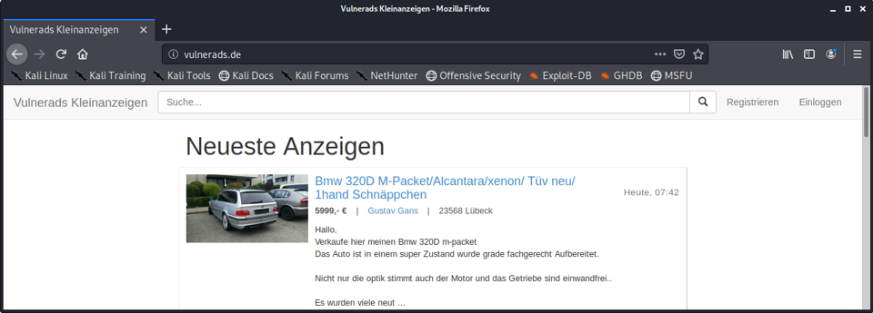

# Welcome to Vulnerads

> Diese Seite gibt es auch auf [Deutsch](/?lang=de)

-----

Moin moin,

you most likely visited this page, because you are going to participate in our training ["Security for Web Applications"](https://oose.com/training/online-training-security-for-web-applications-in-english), ["Web-Authentication"](https://www.oose.de/seminar/web-authentifizierung/), or ["Secure Architectures"](https://www.oose.de/seminar/sichere-architekturen/).

For the practical exercises of this training I have prepared everything you need inside a virtual machine for Oracle VirtualBox. If you are participating in _Security for Web Applications_ or _Web-Authentication_ then you need to download the VM and import it into your VirtualBox before the training, to make sure that you can follow all the fun exercises smoothly. If you are participating in _Secure Architectures_ you should discuss with your team who is going to prepare the virtual machine. Usually 3-4 machines are sufficient for a training, as you will be working in groups of 2 to 4 people.

# Step by Step

1. Download the current version of [VirtualBox](https://www.virtualbox.org/wiki/Downloads) for your host operating system and install it. Do you only have a Mac with ARM processor? No problem, please contact us, we've got a solution for this as well.
2. Download the [virtual machine image](https://vulnerads.de/vm/) (**ca. 13 GB**).
3. Import the downloaded VM into VirtualBox. The VM needs an appropriate amount of memory. Appropriate? I suggest > 10GB, but it must not take more than roughly half of your total memory, to spare some bytes for your host operating system.
4. Now you can go ahead and boot into the machine. It should boot Kali Linux and you should be automatically logged in. Should something unexpected happen and you need the username and password, it's simply `kali` and `kali`. On boot you will see Firefox and IntelliJ IDEA are automatically started.
5. Please verify that your virtual machine is able to access the internet from the browser, as this is a requirement for some of the exercises. You can open [https://www.github.com](https://www.github.com) from Chromium and Firefox to make sure everything works. If you are behind a company proxy, it might be necessary to adjust settings in the browsers. Access from the operating system, terminal, IDE, etc. is not necessary.

The following steps are not necessary, if you are participating in the training _Web-Authentication_, as we won't use the application Vulnerads there.

6. In IntelliJ IDEA the project Vulnerads should be already open, including the main class `de.cqrity.vulnerapp.Vulnerapp`. From there you can start the Vulnerads application like a normal Java application ( ► ). You should see a log output similar to this:

        2021-10-11 20:31:13.643  INFO 16723 --- [           main]
        s.b.c.e.t.TomcatEmbeddedServletContainer : Tomcat started on port(s): 8080/http

        2021-10-11 20:31:13.763  INFO 16723 --- [           main]
        de.cqrity.vulnerapp.Vulnerapp            : Started Vulnerapp in 4.138 seconds (JVM running for 5.657)

7. Now you can open the URL [http://vulnerads.de](http://vulnerads.de) from Firefox or Chromium within the virtual machine and you should see the classified ads application with four ads:

    

# Troubleshooting

## General Troubleshooting

* If the machine stays completely black on booting, then one reason is an older VirtualBox Version. Please make sure that you have installed the latest VirtualBox version! The machine was created using VirtualBox 7.1.6 and is 100% incompatible to VirtualBox 5.x, but sometimes I also see issues with older VirtualBox 6.1.x versions.
* If the image of the virtual machine is unstable, possibly flickering, it sometimes helps to change the graphics adapter in the VM-Settings, e.g., to `VBoxSVGA`.
* If the image of the virtual machine is _incredibly small_ or **enormously large**, then the reason is the DPI-setting of the VM, which does not fit to your monitor. You can change that scaling in the VirtualBox-Window under "View" -> "Virtual Monitor 1".
* If the mouse "doesn't work", i.e., you can't click in a certain rectangle in the top left corner (try it out, it's likely that you _can_ click in the bottom right quarter), then this is a known bug. Most likely the VirtualBox Client-Tools for Drag and Drop or Shared Clipboard have crashed.You can either

  1. Disable and reenable both (Drag and Drop + Shared Clipboard) from the "Devices"-Contextmenu, or

  2. Kill the processes and restart them:  
    List them: `ps aux www | grep VBoxClient --`  
    Kill them: `killall VBoxClient`  
    Start them:  
      `VBoxClient --clipboard`  
      `VBoxClient --vmsvga`  
      `VBoxClient --seamless`  

  3. Reboot the entire VM. 

## Troubleshooting for Windows-Hosts

* When starting the VM you'll get the error Error In supR3HardenedWinReSpawn: NtCreateFile(\Device\VBoxDrvStub) failed: 0xc0000034 STATUS_OBJECT_NAME_NOT_FOUND (0 retries) (rc=-101). That might happen after updating VirtualBox. The error message says: "Rebooting may actually help", and from my experience: Rebooting may actually help. Reboot your PC. Yep, gotta do it.
* If the machine is crazy (!) slow, then you need to disable Hyper-V on your Windows Host. You can find information [here](https://support.microsoft.com/en-us/help/3204980/virtualization-applications-do-not-work-together-with-hyper-v-device-g) or [here](https://www.tenforums.com/tutorials/139405-run-hyper-v-virtualbox-vmware-same-computer.html).
* If the machine is still running slow, then it is highly likely that Hyper-V is still activated. It needs to be deactivated.
* If you made sure that Hyper-V is not running, and the machine is still incredibly slow, then I it could be that Hyper-V is actually still running. Trust me. I've been there :-). You can open `services.msc` to verify that _none_ of the Hyper-V services is running:
    

## Troubleshooting for MacOS-Hosts

* Do you have a Mac with an ARM processor? Unfortunately, the VM won't run on your host then. But fortunately, we've got you covered, just ask us!
* If the applications like IntelliJ or the browser randomly crash with a segfault inside the VM, this might be caused by the [Intel Power Gadget](https://www.virtualbox.org/ticket/20076). Once disabled, this should not happen anymore.
* If you experience the error `Kernel driver not installed (rc=1908)`, then VirtualBox is missing some rights to be executed correctly. You can fix this in the MacOS settings under "Security & Privacy". More information can be found [here](https://www.howtogeek.com/658047/how-to-fix-virtualboxs-%E2%80%9Ckernel-driver-not-installed-rc-1908-error/).
* Please note the difference in the keyboard layout between your MacOS Host and the Guest OS Kali Linux. You can change the keyboard layout via the Kali Linux settings as described [here](https://mayadevbe.me/posts/linux_keyboard_layout/)

# See you!

I hope that your setup runs through smoothly, if you experience any unexpected errors, don't hesitate to contact me! I am looking forward to seeing you soon in the training!

**Hannes**

------

### Imprint

[https://hannesmolsen.de/impressum.html](https://hannesmolsen.de/impressum.html)

### Privacy

[https://hannesmolsen.de/datenschutz.html](https://hannesmolsen.de/datenschutz.html)

